---

Chemical Engineering Science 299 (2024) 120472

The quick brown fox jumps over the lazy dog.

ELSEVIER

Contents lists available at ScienceDirect

Chemical Engineering Science

journal homepage: www.elsevier.com/locate/ces

CHEMICAL ENGINEERING

SCIENCE

Advancing crystal growth prediction: An adaptive kMC model spanning multiple regimes

Satchit Nagpal \( ^{a,b} \) , Niranjan Sitapure \( ^{a,b} \) , Zachary Gagnon \( ^{a} \) , Joseph Sang-II Kwon \( ^{a,b,*} \)

\( ^{a} \)  Artie McFerrin Department of Chemical Engineering, Texas A&M University, College Station, 77845, TX, USA

\( ^{b} \)  Texas A&M Energy Institute, Texas A&M University, College Station, 77845, TX, USA

### ARTICLE INFO

### Keywords:

Crystal growth mechanisms

Kinetic Monte Carlo (kMC)

Crystal morphology

Surface thermodynamics

Attachment energy

### ABSTRACT

Traditional batch crystallization processes encounter challenges like batch-to-batch variability, and difficulty in scale-up and achieving desired crystal size and morphology. These challenges stem from various growth mechanisms within crystallizers, influenced by operating conditions that dictate the dynamic surface structure of crystals. To overcome this, we developed a novel microscopic kinetic Monte Carlo model, which uses a specialized adsorption rate that adapts to different growth regimes by considering surface thermodynamic effects for different growth mechanisms. Specifically, the adaptive adsorption rate redefines the driving force of crystallization by considering the attachment energies of different adsorption sites (e.g., kink, adatom, and edge) and supersaturation. This approach enables seamless transitions across growth regimes. We use the lysozyme crystal system as a case study, demonstrating the model's superior predictive power in regime-to-regime transitions. Overall, the developed work provides a valuable new approach to understanding crystal morphology and predicting crystal growth rates in different growth regimes.

### 1. Introduction

Crystal morphology critically affects the key product specifications and characteristics of various pharmaceutical, food products, and other chemical products. For example, crystal morphology can dictate the activity of certain active pharmaceutical ingredients (APIs) (Klapwijk et al., 2016; Rahim et al., 2018), selectivity to specific downstream reactions (Pudasaini et al., 2017; Trasi et al., 2014), pharmaceutical bioavailability (Blagden et al., 2007; Kumar et al., 2015), and even optoelectronic properties in the case of quantum dots (QDs) (Sitapur et al., 2020, 2022, 2023; Sitapur and Kwon, 2023). Since accurate prediction of crystal surface morphology is essential for fine-tuning the product specifications, it is important to develop a mechanistic understanding of the different factors affecting crystal morphology, resulting in an accurate prediction. Also, analyzing the effect of different operating conditions (e.g., temperature cooling curves, supersaturation level, and others) on crystal morphology enables the engineering of high-quality crystals suitable for drug systems, optoelectronics, and food products (Rutvik et al., 2023; Cheng et al., 2022; Kierzek and Zielenkiewicz, 2001; Piana and Gale, 2005; Song et al., 2020).

The reasons for these drawbacks are mainly because various growth mechanisms prevail inside crystallizers, depending on specific operating conditions that dictate the dynamically evolving surface morphology of crystals. For instance, in the case of solution-grown crystals, the degree of supersaturation emerges as the primary variable that controls the growth mechanism. Generally speaking, there are three important regimes, spiral, step, and rough. First, in the case of a spiral growth regime at low supersaturation, the growth of defects prevails, driven by the increased probability of sticking due to the presence of surface defects (Hartman, 1953; Pimpinelli and Villani, 1999). These defects, including kinks created by screw dislocations, lower the adhesion energy barrier ( \( \Delta G \) ), thereby accelerating crystal growth as the step advances (Yau et al., 2000). On further deposition, crystal growth continues and a fresh step emerges, which grows along a new trajectory, but still parallel to the surface. As this second step propagates, it leaves the defect in its wake, leading to another step. As this continues, the net effect is crystal growth that spirals around the screw defect (Bennema, 1969; Burton et al., 1951; Kuwadia and Doherty, 2011). Second, in the step growth regime at higher supersaturation levels, occasional deposition onto flat crystal surfaces becomes possible as the increased supersaturation lowers  \( \overline{\Delta G} \)  to a point where deposition can occur even on an

* Corresponding author at: Atric McFerrin Department of Chemical Engineering, Texas A&M University, College Station, 77845, TX, USA. E-mail address: kwuox075@tamu.edu (J. Sang-It Kwon).

https://doi.org/10.1016/j.ces.2024.120472

Received 7 October 2023; Received in revised form 10 January 2024; Accepted 6 July 2024

Available online 9 July 2024

0009-2509/© 2024 Elsevier Ltd. All rights are reserved, including those for text and data mining, AI training, and similar technologies.

---

S. Nagpal, N. Sitapur, Z. Gagnon et al.

Chemical Engineering Science 299 (2004) 120472

otherwise clean, flat surface (Benz, 2020; Vekilov and Alexander, 2000). This leads to two-dimensional growth, also known as 'birth-and-spread' growth, as subsequent deposition tends to occur at the newly formed steps (Bales and Zangwill, 1990; Li et al., 2016). Redrow and Kukushkin (2020). Third, at relatively higher temperatures and fields, vertical growth occurs in a rough biogenic regime (Flood, 2010). At higher supersaturation levels during crystal growth, growth units (GUs) tend to adsorb on adatoms (sites on the surface without neighboring steps or terraces) due to the increased availability of adsorption sites and the rapid nature of the growth process. These adatoms do not contribute to the growth of well-structured crystal surfaces, but instead lead to the formation of isolated islands. Over time, these islands may merge and coalesce as growth conditions evolve, eventually developing a continuous crystal layer (Lovette et al., 2008; Bosch et al., 2019). In addition to the described growth mechanisms within crystallizers, it is essential to account for a specific feature known as the hang in the evolving surface morphology of crystals. The hang is a distinctive adsorption site characterized by the presence of three existing nearest neighbors. Formation of the hang typically involves the alignment of a positive or negative kink and a step on the crystal surface (Joswiak et al., 2018). This configuration creates a site with increased adsorption potential due to the availability of a neighboring structure, promoting the adherence of GUs (Kurugurusamy et al., 2022). The hang plays a crucial role in crystal growth dynamics, providing an additional facet to the complex interplay of surface structures and supersaturation levels. It represents a unique adsorption scenario that contributes to the overall intricacies of crystal growth mechanisms, further influencing the evolving morphology as conditions in the crystal tailor vary.

The intricate and diverse surface morphologies observed in various growth conditions, such as spirals, islands, and rough features, provide a strong impetus for the adoption of stochastic modeling techniques like molecular dynamics (MD) and kinetic Monte Carlo (kMC). Despite the atomistic insights afforded by MD simulations into molecular behavior (Cheng et al., 2012; Li et al., 2012; Lovette et al., 2008; Spackman et al., 2023), their scope is restricted to brief time scales (\(\xi_{i} \sim 100\) yr) along with smaller lattice dimensions (Hollingsworth and Dror, 2018). In contrast, kMC simulations present an alternative avenue due to their capacity to encompass larger lattice dimensions (e.g., \(100 \times 100\) to \(500 \times 500\)) and extended time scales (e.g., spanning from 1 \(\mu\)s to \(10,000\) s). This affords profound insights into the evolutionary trajectory of crystal morphology for different growth mechanisms (Lutsko and Maes, 2023). This versatility stems from the manner in which kMC simulations approximate atomistic-level occurrences (e.g., adsorption, migration, desorption) into computationally efficient mesoscopic-level events, ensuring minimal information loss regarding crystal growth mechanisms and dynamic events (Chaffart and Ricardez-Sandoval, 2022; Chatterjee and Vlachos, 2007; Derby and Yeckel, 2004; Duchesin et al., 2019; Kwon et al., 2015; Variankwal et al., 2006; Vlachos and Jensen, 1992). Analysis of the 2013 joint model, a solid-on-solid (SOS) model MC model tailored for the growth of tetragonal-shaped lysozyme crystals. This model encompassed a collection of mesoscopic adsorption, migration, and desorption events. Moreover, they not only experimentally validated, but also integrated the kMC-derived lysozyme crystallization model with diverse reactor models. This synergy facilitated the optimization and control of batch, continuous, and tubular crystallizers, underscoring the precision and adaptability inherent in kMC-based crystallization modeling (Kwon et al., 2013, 2014a,b,c, 2015). However, the aforementioned models, alongside similar kMC counterparts (Benenna et al., 2004; Durbin and Feher, 1991), exhibit limitations in capturing regime-to-regime (R2R) transitions, particularly the progression from rough growth to step growth to spiral growth. These limitations depend on parameters tailored to specific growth regimes, such as adsorption rate coefficients and binding energies between neighboring GUs, derived through trial and error or parameter estimation (Burton et al., 1951; Yamamoto et al., 1988).

Existing methods for predicting crystal growth and morphology that studied the regime transition rely on calculating the surface energies of terraces, edges, and kinks. Among these surface attributes, the first important concepts were the attachment energies, representing the energy released when a layer goes on an crystal (Hartman and Perdek, 1955a,b,c). Hartman and Bennema (1980) found attachment energies that correlated with crystal growth rates under supersaturation, enabling predictions of growth kinetics for spiral and step regimes. Gilmer and Bennema (1972) studied the effects of surface diffusion on crystal growth rates from step to rough regimes. Tilbury and Doherty (2017) developed a way to connect different growth regimes within a mechanistic modeling framework to enable the prediction of crystal shapes dependent on supersaturation. More specifically, they derived expressions to predict the crossover supersaturationspread, stress, and strength growth for various crystal systems (naphthalene, biphenyl, pentacryrithol, \(\beta\)-HMX) and compared the predicted morphologies with experimental crystal shapes reported in the literature. The work of Spackman et al. (2023) presents a valuable Monte Carlo approach for modeling crystal growth and morphology, which can address effects like supersaturation, screw dislocations, and solvers. However, they identified that extending the model to simulated diffusion-limited growth mechanisms in the solution phase is desired to capture phenomena like fractal growth and Hopper-type growth, necessitating the incorporation of local supersaturation parameters and measured diffusion coefficients.

Motivated by the aforementioned previous efforts, a novel microscopic kMC model has been formulated, demonstrating remarkable RZR transferability in predictions of crystal growth rate and surface morphology across an extensive spectrum of concentration gradients. First, the developed kMC model considers the presence of terraes (flat regions), kink sites (atomic steps or defects), edges (terminating steps), adatoms (rough regions), and vacancies (holes) on the crystal surface. This level of detail allows for a more accurate and comprehensive representation of how crystal growth occurs on different faces of the crystal. By capturing the interactions and dynamics of these surface attributes, the kMC model provides insight into the fundamental mechanisms driving step advancements, spiral growth, and roughening, which are crucial in determining the final morphology of the crystal. To focus on layer-by-layer growth in our simulation, we assume dismissing Ehrlich-Schwoebel barriers at the edges of the steps, which prevent a molecule from jumping down a step (Bales and Zangwill, 1990; Pierre Louis and Misbah, 1996; Pierre Louis et al., 1998). Second, the kMC simulation takes into account the thermodynamics of the microscopic level based on supersaturation and attachment energies. Different growth regimes can be observed at varying levels of supersaturation, and the kMC model provides a means to study the transition of crystal growth rates across these different growth regimes. This consideration is essential as it provides a deeper understanding of crystal growth under various experimental conditions and is particularly useful for studying different proteins with different growth behaviors (McPherson and Gavira, 2011; Vekilov and Chernov, 2003). Lastly, the mechanistic model kMC was developed, whose parameters retain fundamental physical principles. This capability enables researchers to easily validate the kinetic parameters for the developed kMC model using experimental growth rate data. By providing a reliable and validated simulation tool, the kMC model becomes a powerful tool for predicting crystal growth behavior accurately and facilitating the design and optimization of crystal growth processes. To determine the capabilities of the developed kMC model, we selected the well-studied tetragonal hen egg white (HEW) lysozyme system as a representative case study. Here, the growth rate for the faces (110) and (101) of the tetragonal crystals was predicted over a wide range of supersaturation and showed excellent agreement with experimental observations. Furthermore, the results were compared with existing kMC models for lysozyme systems, to show the stark difference in their predictive capabilities. Overall, the current work offers a novel kMC-based mesoscopic modeling framework that (a) shows seamless R2R transferability, (b)

2

---

S. Nagpal, N. Sitapurc, Z. Gagnon et al.

Chemical Engineering Science 299 (2024) 120472

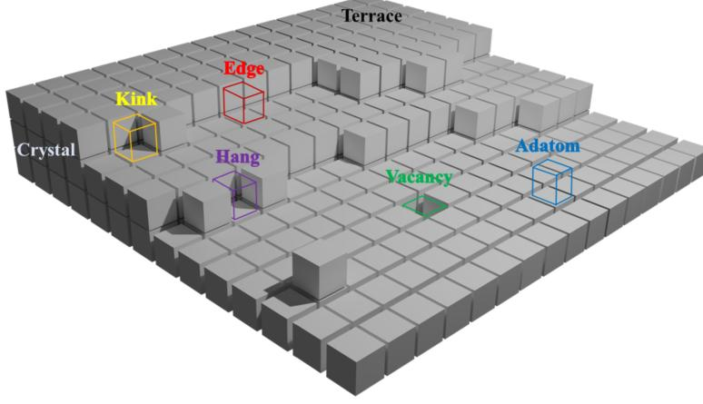

**Fig. 1: Schematic illustration of the structure of the surface of a generalized faceted crystal with different adsorption sites (e.g., kink, edge, adatom, vacancy, hang, and terrace).**

provides accurate predictions of crystal growth rate, and (c) enables visualization of crystal morphology in different regimes.

The remainder of the manuscript is structured as follows. First, we present a microscopic model to describe the various growth mechanisms that occur during crystallization and the role of attachment energies of GUs in connecting these growth mechanisms. Next, a kMC model for the protein crystal is introduced along with a description of the underlying surface kinetics and lattice configuration. Then, we present the developed kMC model comparison with previous models, showcasing the capability to capture crystal growth kinetics and surface-level kinetics for three different regimes of supersaturation. A discussion and conclusion of the current work follows this.

Remark 1: The presented model builds upon the foundations laid by Anderson et al. (2017) and Hill et al. (2021), offering a microscopic kinetic Monte Carlo (kMC) approach tailored for enhanced crystal growth simulations. Notably, it introduces a specialized adsorption rate that dynamically adjusts to local supersaturation and temperature, facilitating smooth regime-to-regime transitions often overlooked by existing models. The model provides a comprehensive representation of crystal surface attributes, considering terraces, kink sites, edges, adatoms, and vacancies, thereby capturing the intricate dynamics of crystal growth on various faces. Thermodynamics at the microscopic level, incorporating supersaturation and attachment energies, further refines the accuracy of growth rate and surface morphology predictions. Recognizing the importance of desolvation, a future model can integrate desolvation effects into free energy expressions, contributing to a more nuanced understanding of crystallization driving forces. While acknowledging the strengths of existing Monte Carlo approaches, the model's distinctive features and detailed solvent effects showcase its advancement in crystal growth modeling, emphasizing opportunities for future work in refining attachment energy, desolvation, and migration dynamics.

### 2. Microscopic description of crystal growth

In this section, a mechanistic description of the surface dynamics occurring during crystal growth is mentioned. Fig. 1 illustrates microscopic sites (i.e., kink, edge, and adatom) used to correlate different growth mechanisms with supersaturation-based growth regimes. Crystal growth regimes refer to different growth mechanisms and patterns observed during the formation of crystals. These regimes are influenced by

the interactions between the crystal's QIs and the surface on which they are growing (Ke et al., 1998). The three main crystal growth regimes are spiral growth, step growth, and rough growth (Li et al., 2016; Yoshizaki et al., 2001).

#### 2.1. Introduction of various growth mechanisms

Crystallization is the process by which QI in a disordered state transitions into an ordered solid state, forming crystals. This phase transition is driven by a decrease in chemical potential energy as QIs move from a higher energy-distorted state to a lower energy-ordered state (Burton et al., 1951; Ustinov, 2019). The rate at which this transition occurs, known as the crystal growth rate, depends on the difference in chemical potential between the disordered states and ordered states (Sun and Xue, 2017). The energy required for QIs to join the crystal lattice, known as the free energy barrier, also contributes to the chemical potential difference (Vekilov, 2007). This barrier depends on the density of adsorption sites, along the faces of the crystal where new QIs can attach.

At higher supersaturation, the chemical potential difference is greater, providing a larger driving force for crystallization. This leads to higher crystal growth rates. When the growth rate is very high and the conditions of high supersaturation, crystals tend to grow in a rough, uncontrolled manner rather than forming smooth, structured surfaces. This rough growth occurs because QUs randomly attach to adatoms on the surface instead of preferentially attaching to steps or kinks, as shown in Fig. 1. Adatoms act as nucleation sites for the formation of isolated crystal islands. The islands may coalesce and merge over time, eventually forming a continuous crystal layer if the growth conditions change or stabilize (Nayhouse et al., 2013). It is typically observed when the crystal growth rate is high, it leads to the nucleation and growth of these individual crystal islands that do not form a continuous crystal layer. The crystal growth rate is highly dependent upon supersaturation since the main driving force of crystallization is the chemical potential, as shown in Fig. 2. Though growth is observed for high supersaturation values during solution-growth crystallization

At lower supersaturation levels, two-dimensional nucleation growth becomes the dominant mechanism for crystal growth. Lewis showed that two-dimensional nucleation requires a lower energy barrier than rough growth, allowing it to dominate at lower supersaturations (Lewis, 1974). New crystal GUs attach to the edges of existing crystal layers, forming terraces or flat plateaus on the crystal surface. It proceeds through the formation of small nuclei on the surface, which then expand laterally,

3

---

S. Nagpal, N. Sitapur, Z. Gagnon et al.

Chemical Engineering Science 299 (2024) 120472

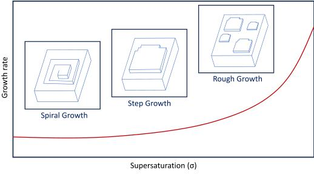

**Fig. 2. Schematic illustration of different growth mechanisms in protein crystallization (Li et al., 2016; Lovette et al., 2008).**

as shown in Fig. 3. This results in layer-by-layer growth and a flat crystal morphology. The crystal surface is characterized by clearly defined steps that represent the boundaries between different crystal layers. Step growth is related to specific adsorption sites known as edge sites, which have only one neighboring step. When GUs are adsorbed onto these edge sites, they become incorporated into the crystal lattice and cause the growth of new layers parallel to the existing crystal surface. Growth proceeds by adding layers, one on top of the other, resulting in the same form of the terraces with uniform thickness (Malkin et al., 1995).

At very low supersaturation, crystal growth becomes negligible and can proceed only when the attachment energy of the site is high. The sites known as kinks are very important because GUs that attach there make more bonds to neighboring GUs than the ones that attach to the terraces or flat step edges. These kink sites are relatively stable and act as nucleation points for further crystal growth. Kink sites are less cations where a crystal step terminates, having two neighboring GUs as shown in Fig. 1. As GUs adsorb onto the kink sites, they contribute to the growth of the crystal in a spiral pattern. Spiral growth is characterized by the continuous addition of new crystal GUs in a helical or spiral arrangement. The newly added GUs attach to the kink sites and then propagate along the crystal surface, forming a continuous spiral. Spiral growth is especially prevalent in growth under certain conditions, such as when the crystal is exposed to low supersaturation levels or in the presence of specific surface defects, such as screw dislocation (Miura, 2020; Shtukenberg et al., 2013). The developed model operating in a spiral growth regime has a higher tendency to attach to these kink sites.

Basically, these are three primary adsorption mechanisms (i.e., spiral, step, and trough) involved in the growth of crystals from a solution. Hartman (1953) first established the correlation between microscopic sites (i.e., kink, edge, and adatom) and growth regimes (i.e., spiral, step, and rough), which was crucial in understanding and controlling crystal growth. Consequently, these different growth regimes can be observed at varying levels of supersaturation, as schematically illustrated in Fig. 2: The interaction between the GUS and microscopic sites influences the growth behavior, crystal morphology, and properties of the resulting crystal (Giulietti et al., 2001; Li et al., 2016; Lovette et al., 2008). This knowledge is essential for crystal engineering, the design of materials with desired properties, and the optimization of crystal growth processes in various applications. For this reason, we utilize thermodynamic to understand and model the surface of the crystal by starting at the microscopic scale of a crystal and providing a potential link to develop a macroscopic view of crystal growth.

#### 2.2. Role of attachment energy

In solution-growth of crystals, the growth mechanism differs not only due to external factors (i.e., supersaturation, temperature, impurities) but also internal factors (i.e., morphology, bonds, defects) (Benenna, 1974; Boistelle and Astier, 1988). Therefore, before discussing

the kinetic equations, it is important to consider the influence of crystal morphology on growth regimes. This relationship between the crystal growth regime and crystal morphology can be understood through the concept of attachment energy. Attachment energy refers to the bond energy released when a GU attaches to a crystal face's surface. Hartman and Perdok (1955a,b,c) suggested a relationship between the attach ment energy and the rate at which G2 attaches to crystal face. They assumed that attachment energy proportional to the time required to form a bond. As the time required for bond formation decreases with increasing attachment energy, the displacement velocity of a crystal face also increases. This implies that the crystal face with higher attachment energy grows faster, leading to crystal shape equilibrium during crystal growth (Hartman and Bennema, 1980). The rate of crystal growth is therefore dependent on the attachment energy of the crystal GUS (Abbona and Aquilano, 2010). Therefore, the attachment energy becomes a representative parameter of morphological importance, as crystal faces with higher attachment energy accumulate the growth regime and play a crucial role in shaping the final surface morphology of the crystal.

Following this paradigm, the developed model views the microscopic scale by considering the presence of terraces (flat regions), kink sites (atomic steps or defects), edges (terminating steps), adatoms (rough regions), and vacancies (holes) on the crystal surface. We then utilized this view of the surface to calculate the different attachment energies to reflect upon the strong or weak interactions of GUs during the crystal growth process. This enables the kMC model to capture fundamental crystal growth mechanisms, including step advancement, spiral growth, or roughgrowing, which are critical in determining crystal morphology.

The developed kMC model can be adapted to various crystal structures and materials based on their attachment energies for their respective GU. This kMC approach can be fine-tuned for different crystal systems and experimental conditions, making it a versatile tool for studying various scenarios. Furthermore, the developed model allows us to estimate the kinetic parameters that ensure high R2R transferability, which shows morphological changes under varying operating conditions. This capability is advantageous as different proteins and experimental conditions exhibit varying growth behaviors.

3. kMC model development

The kMC model is able to use simple probabilistic rules and approximate rate calculations from transition state theory (TST) (Bogleisen, 1952) to efficiently simulate long-time dynamics (Boerrigter et al., 2004). In kMC, the system is modeled as jumping between discrete states, where each state corresponds to a local energy minimum basin. Each possible transition is assigned a probability (rate constant) based on TST. TST provides an approximate way to calculate the rate constant for each possible transition between states and allows the utilization of external and internal factors that affect crystallization. TST assumes that there is a dividing surface that separates the states and calculates the rate as the equilibrium flux through this dividing surface. This avoids having to explicitly simulate the transitions

To demonstrate the capability of using attachment energies to link the transitions across different crystal growth regimes based on surface morphology, we simulate impurity-free crystal growth using the SOS model. In this model, the surface of the crystal is represented as an array of interacting columns with varying integer heights of GUs. It is important to note that, in the SOS model, no vacancy sites are allowed within the crystal. The SOS model is similar to the Terrace-Ledge-Kink model since it allows for clusters of adatoms, surface vacancies, and irregular step structures shown in Fig. 1.. Finally, we neglect the differences in the frequency of vibration and rotational free energy of the molecules in different positions on the crystal surface.

4

---

S. Nagpal, N. Sitapur, Z. Gagnon et al.

Chemical Engineering Science 299 (2004) 120472

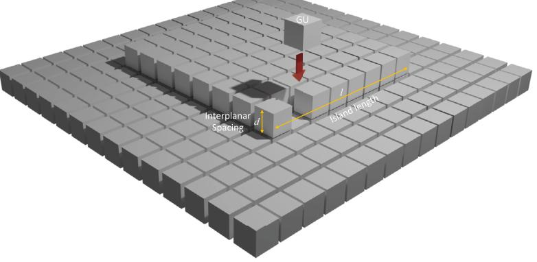

**Fig. 3. Schematic illustration of 2D growth on crystal face.**

#### 3.1. Simulation details

We use the kinetic SOS model to derive the dynamics of crystal growth. First, we considered a square lattice model with a size of \( N = 75 \) sites with periodic boundary conditions. Additionally, kMC simulations at various lattice sizes (i.e., \( N = [50,200] \)) demonstrated that after \( N = 75 \), no significant finite-size effects were observed, and thus for the rest of the work \( N = 75 \) was considered. The crystal surface dynamics are modeled via the attachment, detachment, and surface migration of GUs. Before considering the kinetics of crystal growth, we initialize the operating conditions of the system. The crystal lattice is randomly initialized to have a mixture of different configurations of GUs to remove any bias towards a single kind of configuration. The system is isothermal at a fixed temperature \( T \). Convection, latent heat of crystallization, and lateral interactions are ignored. The rate equations are defined next for the HEW lysosome protein crystal along with the kinetic and thermodynamic parameters used to predict crystal growth rate and surface morphology.

#### 3.2. Surface kinetics

With larger species such as proteins, the contribution of entropy due to solvent trapping or release can be very significant (De Yoreo and Vekilov, 2003). Thus, the driving force behind this process has often been attributed to the overall change in surface free energy \(\gamma\) during crystallization, along with the change in chemical potential of the solution undergoing crystallization, represented as \(\Delta_{\mathrm{ij}}\). The greater the magnitude of \(\Delta_{\mu}\), the more pronounced the growth for the crystallization process (Mullin, 2001; Winn and Doherty, 1998). The \(\Delta_{\mathrm{ij}}\) is defined for a supersaturated solution as

\[

\Delta \mu = k _ {B} T \ln \frac {C}{C _ {v a}} \tag {1}

\]

where  \( k_{B} \)  is the Boltzmann constant, T is the temperature in Kelvin, C is the solute concentration, and  \( C_{va} \)  is the equilibrium solute concentration. For protein molecules,  \( C_{eq} \)  is dependent on the temperature of the solution (Howard et al., 1988). With the addition of GUs to a macroscopic flat crystal surface there is a change in Gibbs free energy (kJ/mol) per mole (at fixed T and P) of the entire system corresponding to

\[

\triangle G = - N \triangle \mu + \gamma^ {\text { off }} A \tag {2}

\]

where N is the number of GUs transferred,  \( \triangle\mu \)  is the chemical potential,  \( \gamma^{off} \)  is the specific surface free energy, and A is the area of the new surface formed (Muttaschive, 2001). The Eq. (2) can be used to examine

the surface free energy change associated with individual clusters of GUs. To a first approximation, the 2-D nucleus is a plate with an isotropic \(\gamma^{off}\), a volume of \(l^2 d\), and an edge area of \(4ld\), where \(d\) is the interlayer spacing and \(l\) is the size of the nucleus as represented in Fig. 3. Gibbs free energy is a function of \(l\) as given by

\[

\triangle G = - l ^ {2} d \frac {\triangle \mu}{V _ {M}} + 4 l d \gamma^ {\text { off   sc }} \tag {3}

\]

where  \( V_{M} \)  is the volume for each GU that attaches to the 2D nucleus. We use this Gibbs free energy to find the stability of each nucleus on the crystal surface. At a certain critical size  \( \Delta G \)  reaches a maximum. The critical size  \( l_{A} \)  at which this occurs is found by taking the derivative of Eq. (3) with respect to l and is given by

\[

l _ {c} = \frac {2 \gamma^ {\text { off   sc }} V _ {M}}{\triangle \mu} \tag {4}

\]

This critical size  \( l_{A} \)  correlates the surface morphology with the super saturation and predicts the different growth regimes observed. When the supersaturation is in a spiral growth regime, the critical size  \( l_{A} \)  becomes large and we observe a smoother surface unless a surface defect is present on the lattice. As supersaturation increases to the step growth regime, a cluster of islands is created with a size approximately equal to its critical size  \( l_{c} \) . As the supersaturation increases to the rough growth regime, the island's size decreases until it is smaller than the size of unit GU, and the roughening of surface morphology starts. If a cluster is larger than its critical size, it has a higher probability to grow than de-cay, while if the cluster is smaller than this critical size, it has a higher probability to decay.

To integrate this mechanism into the kMC model, we first need to calculate the free energy change for each GU transferred during the adsorption event, given by

\[

\triangle G _ {G U} = - \triangle \mu + A _ {G U} r _ {d e g} \tag {5}

\]

where  \( A_{GU} \)  represents the area gain due to the attachment of GU and collectively  \( A_{GU} \times r_{deg} \)  represents the bond energy for respective GU. Based upon the nearest neighbor i defined individually for adatom, step, kink, hang, and vacancy, this area can be calculated as  \( A_{GU} = tA_{fi} \) , where  \( A_{f} \)  is the area of each face for the GU being attached as shown in Fig. 4. On the basis of various sites having their respective i and  \( A_{GU} \)  we posit that the time required for bond formation decreases with increasing bond energy. As a result, the displacement velocity of a crystal face increases with higher attachment energy, making the attachment energy a meaningful indicator of its morphological significance. In other words, a crystal face will vanish sooner during crystal growth if it moves away

5

---

S. Nagpal, N. Situpare, Z. Gagnon et al.

Chemical Engineering Science 299 (2024) 120472

(a) Initial surface

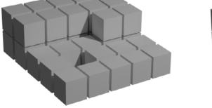

(b) adatom

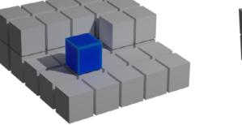

(c) step

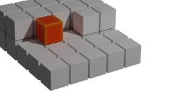

(d) kink

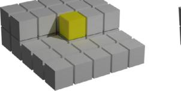

(e) hang

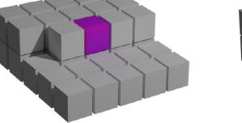

(f) vacancy

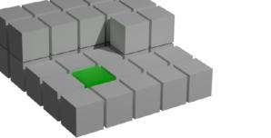

**Fig. 4. (a) Initial surface, (b) adatom \((i = 0)\), (c) edge \((i = 1)\), (d) kink \((i = 2)\), (e) hang \((i = 3)\), and (f) vacancy \((i = 4)\) depict the different adsorption configurations considered in this work.**

from the growth center at a faster rate. This indicates that the adsorption rate of each GU is dependent on the free energy barrier as follows:

\[

r _ {a} = K _ {a} \exp \left(- \frac {\triangle G _ {G U}}{k _ {B} T}\right) \tag {6}

\]

where  \( K_{a} \)  is the attachment kinetic coefficient. On substituting  \( \triangle G_{GU} \)  to Eq. (6),

\[

r _ {a _ {i}} = K _ {0} ^ {+} \exp \left(\frac {\triangle \mu}{k _ {B} T} + (\frac {\delta}{2 \triangle \mu})\right) \tag {7}

\]

where  \( K_{0}^{+} \) is the modified attachment coefficient, i is the number of nearest neighbors representing respective adsorption sites, and  \( \delta \)  denotes the attachment energy to connect the growth rate regimes with the supersaturation for a particular crystallization system. The parameter  \( \delta \)  controls the transition width for each regime and has to be estimated using experimental growth rates across growth regimes for the respective crystallization system. The  \( r_{a_{0}} \)  function unifies a smooth transition between rough, step, and spiral crystal growth with decreasing supersaturation. Thus, the total rate of adsorption for each type of site (i.e.,  \( a_{0} \)  adatom, step, kink, hang, and vacancy) is defined as

\[

W _ {a} = \sum_ {i = 0} ^ {1} M _ {i} r _ {a _ {i}} \tag {8}

\]

where  \( M_{i} \)  is the number of lattice sites for the respective adsorption sites, i.e., adatom, step, kink, hang, and vacancy with  \( (0,1,2,3,4) \)  nearest neighbors, respectively. Durbin and Feher (1986) discovered that only half of the lattice sites on the face (101) were suitable for adsorption, whereas all lattice sites on the face (110) were accessible. This disparity arises because only half of the GBs on the facet (101) possess dangling bonds, which serve as attachment points for the incoming GUs. Conversely, every molecule on the (110) face has dangling bonds (Durbin and Feher, 1991). To solve this disparity, the parameter  \( \delta \)  is found to be dependent upon the unit GU's dimensions, thereby accounting for the different faces of the crystal. After the adsorption event was determined, we selected the specific site to introduce the subsequent molecule as shown in Fig. 4. The crystal surface is in dynamic equilibrium with GUs in the surrounding solution. GUs are constantly attached to the crystal surface (adsorption) and detach from the surface back into solution (desorption). Growth from a supersaturated solution occurs because the flux of GUs attached to the crystal surface exceeds the flux of GUs detached from the surface (De Yoreo and Vekilov, 2003). Desorption occurs when a GU breaks its interactions or bonds with the crystal surface and returns to the solvated state in solution. This reduces the number of GUs on that crystal face as shown in Fig. 5a. The desorption

(a)

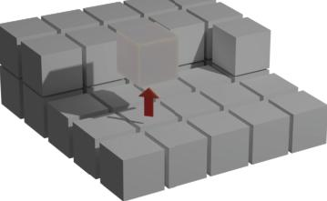

(b)

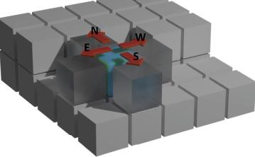

**Fig. 5: Schematic illustration of (a) desorption, and (b) migration events occurring on the crystal lattice.**

rate is dependent on the surface micro-configuration (number of nearest neighbors for each site) surrounding that surface particle as follows:

\[

r _ {d _ {i}} = K _ {d} ^ {-} E _ {p b} = K _ {0} ^ {-} \exp \left(\frac {- E _ {b}}{k _ {B} T}\right) = K _ {0} ^ {-} \exp \left(- i \frac {E _ {p b}}{k _ {B} T}\right) \tag {9}

\]

where  \( K_{0}^{-} \) is the desorption coefficient,  \( E_{pb} \)  is the average binding energy per bond, and  \( E_{b}=iE_{pb} \)  is the total binding energy. Simulations of the developed kMC model are based on the so-called rejection-free method of Bortz, Kalos, and Lebowitz (BKL) (Bortz et al., 1975). The BKL algorithm is built on the assumption that the kMC model features N independent Poisson processes with rates that sum to give the total rate. As expected, the desorption rate is lower when i is higher. The total rate of desorption is computed as follows

\[

W _ {d} = \sum_ {i = 0} ^ {4} M _ {i} r _ {d _ {i}} \tag {10}

\]

where \(M_{i}\) is the number of lattice sites with \(i\) nearest neighbors.

6

---

S. Nagpal, N. Sitapur, Z. Gagnon et al.

Chemical Engineering Science 299 (2024) 120472

Migration or surface diffusion refers to the process where adsorbed GUS move across the crystal surface to find optimal sites for incorporation during crystal growth. It relocates the GUS without desorption and facilitates proper positioning for crystallization as shown in Fig. 5b. GUS hop from site to site with a frequency proportional to the rates of processes. To define the migration rate, Ke et al. (1998) used a rate similar to the desorption rate that includes an additional term. This term causes migration to have a higher rate compared to the desorption rate and is defined in the following manner:

\[

r _ {m _ {i}} = K _ {0} ^ {-} \exp \left(\frac {E _ {p b}}{2 k _ {B} T} - i \frac {E _ {p b}}{k _ {B} T}\right) \tag {11}

\]

Consequently, the total migration rate is computed as follows:

\[

W _ {m} = \sum_ {i = 0} ^ {3} M _ {i} r _ {m _ {i}} \tag {12}

\]

To focus on layer-by-layer growth in our simulation, we assume dismissing Ehrlich-Schwoebel barriers at the edges of the steps, which prevent a molecule from jumping down a step (Bales and Zangwill, 1990; Pierre Louis and Misbah, 1996; Pierre Louis et al., 1998). To further simplify the above rate equations, as pointed out by Durbin and Feher (1991), \( K_0^+ \) and \( K_0^- \) are not independent. At equilibrium, the change in Gibbs free energy would be zero, and thus the attachment and detachment rates will be equal:

\[

r _ {a _ {i}} (\triangle G = 0) = r _ {d _ {i}} (\phi) \tag {13}

\]

where \(\phi\) is the binding energy per GU of a fully occupied lattice. Thus, thermodynamic equilibrium provides the following correlation between the coefficients of adsorption, \(K_0^+\), and desorption, \(K_0^-\),

\[

K _ {0} ^ {-} = K _ {0} ^ {+} \exp \left(\frac {\phi}{k _ {B} T}\right) \tag {14}

\]

With one additional substitution, the desorption and migration rate equations take the following form.

\[

r _ {d _ {i}} = K _ {0} ^ {+} \exp \left(\frac {\phi}{k _ {B} T} - \left(\frac {F _ {d h}}{k _ {B} T}\right)\right) \tag {15}

\]

\[

r _ {m _ {i}} = K _ {0} ^ {+} \exp \left(\frac {\phi}{k _ {B} T} + \frac {F _ {d h}}{2 k _ {B} T} - \left(\frac {E _ {d h}}{k _ {B} T}\right)\right) \tag {16}

\]

Given the above rate expressions for the different microscopic events (i.e., adsorption, desorption, and migration), the total rate can be computed as the sum of these rates, as follows:

\[

W _ {t o t} = W _ {d} + W _ {d} + W _ {m} \tag {17}

\]

#### 3.3. Event execution

The selection and execution of a specific kMC event rely on the computation of microscopic rates, as elaborated in the preceding section. Following the execution of each event, a time increment denoted as  \( \triangle t_{i,MC} \)  is determined. This increment is computed based on the cumulative rate of the microscopic events and is then randomly sampled from a Poisson distribution to determine the time until the next event occurs, as illustrated below:

\[

\triangle t _ {i, M C} = \frac {\ln (\zeta_ {t})}{W _ {t o t}} \tag {18}

\]

where \(\zeta_{t}\) is a uniform random number, \(\zeta_{t} \in (0,1]\). The flow cycle in Fig. 6 represents the entire algorithm for each event and execution condition.

We use the probabilities \( P_{i-1}, P_{i+1} \) and \( P_{th} \) to decide which event to execute, as shown in Table 1. To execute an event, a uniform random number \( \xi_{t} \in (0,1] \) is generated. If \( \xi_{t} \leq W_{th}/W_{tot} \), then an adsorption event is executed. If \( W_{th}/W_{tot} \leq \xi_{t} \leq (W_{th} + W_{tot})/W_{tot} \), then a desorption event is executed. Lastly, if \( \xi_{t} \geq (W_{th} + W_{tot})/W_{tot} \) then a migration event is executed, as illustrated in Table 1. For the case of adsorption, desorp

**Table 1**

Probability conditions for selecting a kMC event.

<table><tr><td>Probability Conditions</td><td>Event Executed</td></tr><tr><td>0 &lt; ξ ≤ PL</td><td>Adsorption</td></tr><tr><td>PL &lt; ξ ≤ PL + PL</td><td>Desorption</td></tr><tr><td>PL + PL &lt; ξ ≤ PL + PL + PR</td><td>Migration</td></tr></table>

**Table 2**

Probability conditions for selecting protein case i with an event defined as j = 1 (attachment), 2 (detachment), 3 (migration).

<table><tr><td>Probability Conditions</td><td>Number of Neighbors</td></tr><tr><td>0 &lt; ξ ≤ \( \frac{v_{lim}}{v_{tot}} \)</td><td>Number of Neighbors</td></tr><tr><td>\( \frac{v_{lim}}{\sum_{i=1}^{n} \cos(\xi)} &lt; \xi_i \leq \frac{\sum_{i=1}^{n} v_{lim}}{v_{tot}} \)</td><td>One</td></tr><tr><td>\( \frac{\sum_{i=1}^{n} v_{lim}}{\sum_{i=1}^{n} v_{tot}} &lt; \xi_i \leq \frac{\sum_{i=1}^{n} v_{lim}}{\sum_{i=1}^{n} v_{tot}} \)</td><td>Two</td></tr><tr><td>\( \frac{\sum_{i=1}^{n} v_{lim}}{\sum_{i=1}^{n} v_{tot}} &lt;\xi_i \leq \frac{\sum_{i=1}^{n} v_{lim}}{\sum_{i=1}^{n} v_{tot}} \)</td><td>Three</td></tr><tr><td>\( \frac{\sum_{i=1}^{n} v_{lim}}{\sum_{i=1}^{n} v_{tot}} &lt;&lt; \xi_i \leq 1 \)</td><td>Four</td></tr></table>

tion, and migration, the specific class must be determined. In the case of an adsorption event, the  \( i^{th} \)  class is determined to be an integer from 0 to 4. Once the class is determined, a second random number is generated to select a random lattice site within the class i to execute the desorption event. Desorption and migration events work analogously to adsorption events, with a minor modification. Table 2 represents the event selection conditions for all three events based on their nearest neighbors. For migration, the lattice site classes are to be chosen based on a random direction, as a GU cannot migrate to a higher step. Thus, first, a direction is chosen randomly and then checked if the migration is feasible. There is a corresponding time increment regardless of whether the event is successful or unsuccessful. For our research, an available migration site refers to the nearest neighboring site lower in height than the current lattice site where the migration event occurs. Similarly to the approach used by Gilmer and Benema (1972), each available migration site is assigned an equal probability of accepting the displaced particle.

### 4. Results and discussion

This section presents the validation of the developed kMC model for growth rates and a comparison with the existing kMC model. Further, the surface morphology for different growth regimes is visualized.

#### 4.1. Comparison of growth rates

The kMC model adopts a bottom-up approach, simulating molecular-scale processes to accurately predict macroscopic crystal behavior. This high level of granularity is essential to understand the fundamental mechanisms that govern crystal growth and morphology. In this study, we explored the growth rates of HEl Voyseyze crystal faces under different supersaturation conditions, where the supersaturation ranges from \( S = \triangle \mu / RT \in [1.0, 8.0] \). The parameters of the developed kMC model were carefully fine-tuned to match the growth rate trend for the two faces of the tetragonal HEl Voyseyze crystal (i.e., 110 and 101).

First, the crystal growth rates were examined over a protein solution concentration range of 30.0 to \(15.0\mathrm{mg / mL}\), and a solubility value of \(15\mathrm{mg / mL}\). Second, a range of values to \(E_{\mathrm{coh}}\) and \(\phi\) was assigned until a satisfactory agreement between the calculated and experimental growth rates was achieved. A grid search approach was followed to estimate parameters as \(E_{coh} / k_B T = 0.48\) and \(\phi / k_B T = 3.76\) for the face (110) and \(E_{ph} / k_B T = 2.12\) and \(\phi / k_B T = 4.27\) for the face (101). These values for \(E_{ph} / k_B T\) and \(\phi / k_B T\) are required for Eqs. (13)-(14). We used the experimental results for HEW lysosome from Yoshizaki et al. (2001) to estimate \(\delta_{110}\) as 0.63, 0.83, 0.30, \(K_d^*\) as 0.211 and validated our model

7

---

S. Nagpal, N. Sitapur, Z. Gagnon et al.

Chemical Engineering Science 299 (2024) 120472

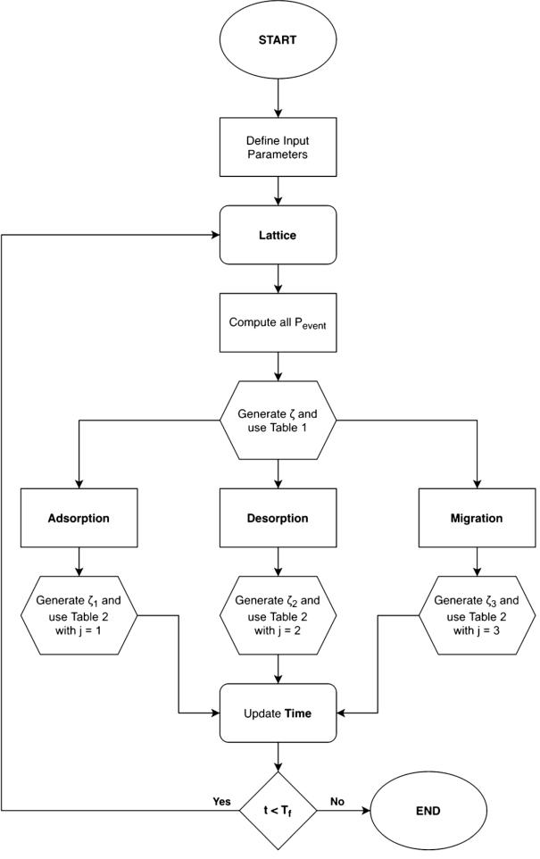

**Fig. 6. Flow diagram of kMC algorithm adapted to simulate crystal growth in various growth regimes.**

based on the growth rates for each regime. Third, the calculation of the growth rate for each face requires the use of kMC simulations because of the dependence of the attachment, detachment, and migration rates on the surface microconfiguration. The control of different growth rates in various regimes is based on a parameter  \( \delta \)  defined in Eq. (4) that governs the locations of the GUs attachment.

The average growth rate for the respective faces (i.e., 101 and 110) obtained from ten independent kMC simulations for each set of conditions is displayed in Fig. 7. Remarkably, the kMC results align very closely (i.e., \( J_{1,1} = 0.96 \) and \( E_{K_s} = 0.98 \)) with the experimental data reported by Yoshiraki et al. (2001). Specifically, the developed kMC model effectively predicts crystal growth in all three regimes. The growth rate curve is divided into three distinct areas corresponding to the typical cases of rough growth, step growth, and spiral growth. For instance, in the spiral regime, characterized by low supersaturation levels, the growth rate is minimal due to the scarcity of GUs in the solution phase. Consequently, the probability of GUs adsorbing onto the crystal surface is low, leading to sluggish growth rates. As supersaturation increases, more GUs become available in the solution, thereby boosting the growth

rates as more GUs adsorb onto the crystal surface. However, in the step growth regime, the growth rate curves exhibit a linear region for both (110) and (101) faces as supersaturation decreases further. Similar observations have been reported in other crystal growth studies, such as the crystal growth of n-hexane, where the growth rate curves were also divided into three regimes in which they observed a surface transition from smooth to rough growth (Liu et al., 1992).

At low supersaturation levels, the driving force from supersaturation is not enough for crystal growth and relies on the attachment energy of the G3u to persist in stable states. The developed model incorporates this behavior by introducing a probability of adsorption into these stable states. Fig. 8 describes how the function of the lattice configuration be halves with the change in supersaturation. It illustrates the probabilities as a function of supersaturation, revealing that the kink sites are favorable in the spiral growth regime compared to the step or adatom sites. In contrast, the step sites become more favorable in the step growth regime. As supersaturation increases further, adatom sites become more favorable, resulting in rougher surface morphology. These surface descriptors are interconnected with desorption and migration rates, collectively

8

---

S. Nogal, N. Stupare, Z. Gagnon et al.

Chemical Engineering Science 299 (2024) 120472

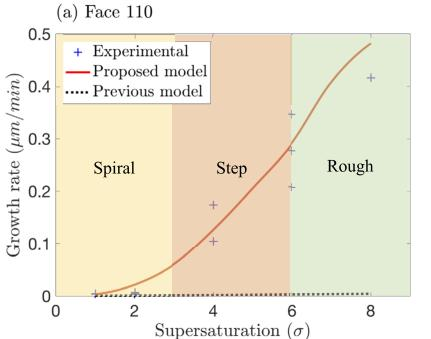

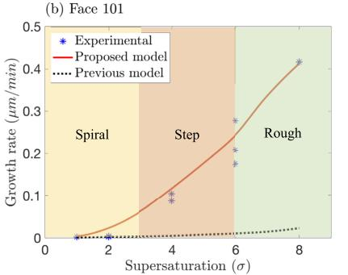

**Fig. 7: Comparison of growth rate predictions by the developed model and an existing kMC model (Nayhouse et al., 2013) for (a) (110) and (b) (101) face along with the representation of experimentally determined growth rate (Yoshiaki et al., 2001).**

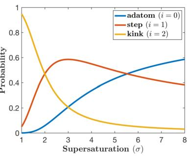

**Fig. 8. Probability of adsorption of the GUs as a function of supersaturation.**

governing the overall crystal growth process shown in Fig. 7. The interest setting probabilities define the transition point of growth regimes for spiral-step and step-group. In particular, the kinetic data revealed that in the rough regime of crystallization, islands begin to form because the faces regain surface energy at a specific supersaturation level \((S \geq 6)\). This phenomenon is captured in the developed KMC model, where the critical size of the islands decreases, thus increasing the probability of growth due to the attachments of the adatoms shown in Fig. S8.

To further highlight the superiority of the current model, a previous kMC model developed by Nayhouse et al. (2013) was simulated for the same set of conditions (i.e., black dashed line in Fig. 7). The previously developed model is devoid of site-dependent adsorption rates

and simply treats all lattice sites with equal probability. Using this assumption, Nayhouse et al. (2013) fine-tuned the parameters of the kMC model (i.e. \( K \), \( E_{ph} \), and \( \phi_B \)) to match the experimental predictions for only low supersaturation (i.e., \( S \leq 2 \)). Unfortunately, regulating such system-specific parameters makes their model vulnerable to poor R2R transferability. Although the previous model is accurate for \( S < 2 \) (i.e., low supersaturation conditions within the spiral regime), it cannot further predict growth rates without fine-tuning the parameters of the kMC model for the rest of the operating conditions. This stark difference in performance can be explained below.

Although the kMC simulation previously developed and the one presented in this study employ similar equations for migration and desorption events, their approaches to calculating the adsorption rate differ significantly. More precisely, in the developed model, the adsorption rate and the probability of choosing different adsorption sites (i.e., adatom, kink, and edge) are dictated by the supersaturation level. Varying supersaturation levels affect the probability of GUs adsorbing on different microscopic sites (i.e., adatom, edge, and kink) due to different attachment energies. As shown in Fig. 8, for very low supersaturation (i.e., \( S \leq 2 \)), Eq. (7) suggests that the probability of adsorption at the kink site is much higher than at the adatom and sites, thus resulting in the spiral growth regime. As supersaturation increases (i.e., \( S \in [3,6] \)), adsorption is dominated at the step sites (i.e., step growth regime), and at high supersaturation (rough growth regime), the adatom sites being the most probable as the rate of GU adsorption is driven by mass transport. This sophisticated maneuvering of the adsorption rate at different sites using the attachment energy allows the developed model to accurately track the experimental observations in crystal growth. The developed model demonstrates its ability to accurately predict the growth rate and seamless R2R transferability, unlike previously developed kMC models. Furthermore, Fig. 8 provides a visual interpretation of the dynamically changing adsorption probabilities of different adsorption sites (i.e., adatom, kink, and edge), which is absent from the previously developed model. Moreover, the excellent agreement between the predictions of the developed kMC model and experimental data underlines the value of the developed model for the incorporation of realistic microscopic events in a generalized kMC framework that can be extended to various other protein and square crystallization systems.

Remark 2: As evident from Fig. 7, our current model, while showing a certain deviation at low supersaturation, presents a more versatile performance, capable of predicting crystal surface morphologies across a spectrum of supersaturation levels. We acknowledge this deviation in our model's prediction at low supersaturation compared with the previous kMC model (Nayhouse et al., 2013) and recognize the need for further refinement. With continued refinement of the current model for desolvation and migration events and calibration of attachment energy parameters against a comprehensive experimental dataset, we believe our model holds the potential to enhance growth rate predictions not only at higher supersaturation but also across the entire range of operating conditions, providing a more robust and versatile tool for crystal growth predictions.

#### 4.2. Surface morphology

A visual representation of intermediate kMC dynamics can be constructed to further probe the surface-level crystal morphology. Fig. 9 presents a series of snapshots that illustrate the lattice structure at different time steps, offering valuable information on the evolution of surface morphology during different growth regimes. In Fig. 9, the color representation serves to distinguish between different states of crystal growth on the simulated surface. The blue base signifies the fully filled crystal structure, where crystal growth units have densely occupied the entire area. On the other hand, the red areas represent the top surface of the crystal where modifications in crystal growth units are ongoing,

9

---

S. Nagpal, N. Sitapure, Z. Gagnon et al.

Chemical Engineering Science 299 (2004) 120472

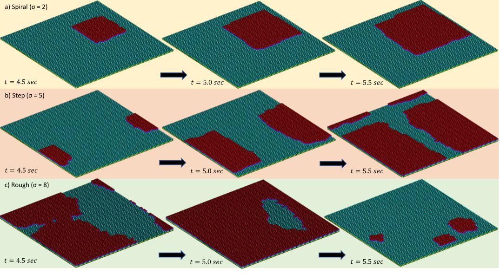

**Fig. 9. Compilation of snapshots of surface morphology in different growth regimes.**

displaying various patterns contingent upon the local supersaturation conditions:

For example, in the spiral growth regime (Fig. 9a), crystal growth is observed to begin from a single island and progress in a distinct spiral shape. The emergence of this spiral growth pattern is explained by the higher probability of adsorption at the kink sites. These sites serve as preferential nucleation points for crystal growth, leading to the observed spiral pattern. The developed model effectively captures this behavior, further supporting its reliability in predicting crystal growth morphology.

Similarly, in the step growth regime (Fig. 9b), the growth dynamics change from a uniform expansion of a single island to a more one-sided growth pattern. This change is attributed to the increased probability of adsorption at sites with a single nearest neighbor, which results in the formation of jagged edges (Lutosko and Maes, 2023; Kuznetsov et al., 1997b). The previously developed model was not able to predict the surface morphology of the crystal face, as the model without the use of attachment energies has equal adsorption probability for each adsorption site. The developed model successfully reproduces this phenomenon, providing a detailed depiction of the step-growth behavior and its influence on the crystal surface morphology. Lastly, in the rough growth regime (Fig. 9c), we observe a more random and disordered growth pattern that forms several individual islands. The growth of these islands is significantly affected by the rates of desorption and migration, which influence their future development in arrangement on the surface. During the rough growth phase, as depicted in Fig. 9c, a notable transition occurs after \( t = 5.5 \) sec. At this point, the large area of red on the top surface disappears, indicating that the growth units have completed their modification, and this region has transitioned into the fully filled state represented by the blue color. Simultaneously, a substantial area of new red appears on the top surface, signifying the initiation of a fresh layer of crystal growth units. This dynamic interplay between red and blue regions underscores the evolving nature of crystal growth, where different sections of the crystal surface undergo continuous modification and growth in response to changing supersaturation levels.

In general, Fig. 9 shows the ability of the developed model to predict the surface growth of protein crystals in different growth regimes. By providing a detailed representation of the crystal growth process, our model holds significant promise for advancing drug discovery and pharmaceutical applications by enabling more accurate predictions of crystal morphology and behavior.

Remark 3: The mechanistic model developed in this work provides an excellent physics-based foundation that can be further enhanced using machine learning tools like time-series transformers (TSTs) (Sitapure and Kwon, 2023a). As shown in recent works, TSTs leverage multi-headed attention and transfer learning to achieve remarkable predictive capabilities and system-to-system transferability for chemical processes (Sitapure and Kwon, 2023b). By combining the interpretability and adaptability of the first-principles model with the long-term predictive power of TSTs, an advanced hybrid framework can be constructed. Specifically, the model parameters and kinetics equations from the mechanistic model can inform the architecture and feature selection of the TST (Sitapure and Kwon, 2023c). Meanwhile, the TST's superior long-term extrapolative abilities can compensate for limitations in the first-principles model. This allows the creation of an accurate digital twin that retains interpretability through the integration of fundamental physics and data-driven learning. Such a hybrid approach would push the boundaries of what is possible in crystal growth prediction and control, providing a valuable tool for pharmaceutical and industrial crystallization processes.

### 5. Conclusions

Despite the development of various sophisticated MD and kMC models to predict microscopic crystal growth and morphology with varying accuracy and computational expense, a quick and accurate regime-agnostic model remains to be desired. Most existing models utilize regime-specific kinetic parameters that result in poor R2R transferability, which leads to a plant-model mismatch in predicting crystal growth under a wide range of operating conditions. In response to this chal-

10

---

S. Nagpal, N. Sitapur, Z. Gagnon et al.

Chemical Engineering Science 299 (2024) 120472

lenge, a pioneering kMC model was developed, which introduces a specialized adsorption rate that dynamically adapts to various growth regimes based on local supersaturation and temperature values. This novel approach incorporates mesoscopic-level migration and desorption rates, along with the adaptive adsorption rate, enabling a seamless transition between different growth regimes. The efficacy of the developed kMC model was demonstrated through a comprehensive case study involving the lysozyme crystal system, which yielded excellent results that were validated against experimental growth rate data. Furthermore, a comparative analysis was conducted, comparing the newly developed kMC model against existing ones, which substantiated its superiority ink accuracy predicting R2R transitions. This advancement marks a substantial step forward in crystal growth modeling, offering valuable insights into crystal morphology and growth rates across diverse growth regimes. On a larger scale, this mechanistic approach marks a significant advancement in crystal growth modeling, providing insights that can enhance drug discovery, structural determination, and the optimization of pharmaceutical and industrial processes.

### CRediT authorship contribution statement

Satchit Nagpal: Conceptualization, Data curation, Formal analysis, Investigation, Methodology, Software, Validation, Visualization, Writing – original draft, Writing – review & editing. Niranjan Sitapure: conceptualization, Formal analysis, Methodology, Visualization; Writing – organization, Writing – review & editing; Zachary Gagnon: Conceptualization, Funding acquisition, Project administration, Supervision, Writing – review & editing. Joseph Sang-II Kwon: Conceptualization, Formal analysis, Funding acquisition, Investigation, Methodology, Project administration, Resources, Supervision, Validation, Writing – original draft, Writing – review & editing.

### Declaration of competing interest

The authors declare that they have no known competing financial interests or personal relationships that could have appeared to influence the work reported in this paper.

### Data availability

Data will be made available on request.

### Acknowledgements

The authors would like to acknowledge the support received by the Artie McFerrin Department of Chemical Engineering at Texas A&M University, and the Texas A&M Energy Institute in the form of startup funds as well as the Texas A&M High-Performance Research Computing (HPRC) for providing advanced computing resources to conduct large-scale simulations.

### References

Abbona, F., Aquilano, D., 2010. Morphology of Crystals Grown from Solutions. Springer Berlin Heidelberg, Berlin, Heidelberg, pp. 53–92.

Abrown, M.W., Geble-Braye, J.T., Hill, A.R., Farida, N., Attfield, M.P., Cubillas, P., Balato, V.A., Proserpio, D.M., Akopyan, D., Arstad, B., Gale, J.D., 2017. Predicting crystal growth via a unified kinetic three-dimensional partition model. Nature 544, 456–459.

Bales, G.S., Zangwill, A., 1990. Morphological instability of a terrace edge during step-flow growth. Phys. Rev. B 41, 5500–5508.

Bennema, P., 1969. The importance of surface diffusion for crystal growth from solution. J. Cryst. Growth 5, 29–43.

Bennema, P., 1974. Crystal growth from solution — theory and experiment. J. Cryst. Growth 225, 745–763.

Bennema, P., Meeks, H., Boerrigter, S.X.M., Cuppen, H.M., Deji, M.A., van Eupen, J., Verwer, P., Vlieg, E., 2004. Crystal growth and morphology: new developments in an integrated Hartman perkin connected rod fortiori: roughness growth, austereity, and temperature simulations. Cryst. Growth Des. 4, 905–913.

Benz, K.W., 2020. Handbook of Industrial Crystallization, 3 ed., vol. S3. Cambridge University Press.

Bügelstein, J., 1952. The effects of isotopic substitution on the rates of chemical reactions. J. Phys. Chem. 56, 823–828.

Blagden, N., de Matas, M., Gavan, P.T., York, P., 2007. Crystal engineering of active pharmaceutical ingredients to improve solubility and dissolution rates. Adv. Drug Deliv. Rev. 59 (7), 617–630.

Borgerink, S.R., Loft, J., Seaton, G.P.H., van de Streek, J., Hollander, F.F.A., Los, J., Cuppen, H.M., Bennema, P., Meekes, H., 2004. MONTY: Monte Carlo crystal growth on any crystal structure in any crystallographic orientation; application to futs. J. Phys. Chem. A 108, 5894–5902.

Boiselle, R., Astier, J., 1988. Crystallization mechanisms in solution. J. Cryst. Growth 90, 14–30.

Bartz, A.B., Kalos, M.H., Lebowitz, J.L., 1975. A new algorithm for Monte Carlo simulation of Ising spin systems. J. Comput. Phys. 17, 10–18.

Burton, W.K., Cabrera, N., Frank, F.C., Mott, N.F., 1951. The growth of crystals and the equilibrium structure of their surfaces. Philos. Trans. R. Soc. Lond. Ser. A, Math. Phys. Sci., 243, 299–338.

Chaffart, D., Ricardez-Sandoval, L.A., 2022. A three dimensional kinetic Monte Carlo defect-free crystal dissolution model for biological system. Mol. application to uncertainty analysis and robust optimization. Comput. Chem. 19, 1577, 105586.

Chatterjee, A., Vlachos, D.G., 2007. An overview of spatial microscopic and accelerated kinetic Monte Carlo methods. J. Comput.-Aided Mater. Des. 14, 253–308.

Cheng, Y., She, C., Qiao, M., Jin, S., Chen, S., Li, L., Chen, K., 2002. Molecular dynamics simulation on the crystal morphogeny of p-HMGAT定的配体 by random energy star terms. J. Cryst. Growth 598, 126874.

De Toney, J.A., Vellido, P.G., 2003. Principles of crystal nucleation and growth. Rev. Mineral.OGeochem. 54, 57–93.

Derby, J.J., Yeckel, A., 2004. Modeling of crystal growth processes. In: Crystal Growth - from Fundamentals to Technology. Elsevier Science B.V., Amsterdam, pp. 143–167.

Duchstein, P., Eyers, P., Zahn, D., 2019. Molecular simulation of crystal growth: from understanding to tailoring. Adv. Econ. Microf. 39, 570–529.

Durbin, S., Felber, G., 1986. Crystal growth studies of lysozyme as a model for protein crystallization. J. Cryst. Growth 78, 583–592.

Durbin, S., Felber, G., 1991. Simulation of lysozyme crystal growth by the Monte Carlo method. J. Cryst. Growth 110, 41–51.

Flood, A.E., 2010. Feedback between crystal growth rates and surface roughness. CrystEngComm 12, 313–323.

Gilmer, G.H., Bennema, P., 1972. Simulation of crystal growth with surface diffusion. J. Appl. Phys. 43, 1347–1360.

Giulietti, M., Seckler, M., Derenzo, S., Ré, M., Cekinski, E., 2001. Industrial crystallization and precipitation from solution states: of the technique. Braz. J. Chem. Eng. 18, 423–440.

Hartman, P., 1953. Relations between structure and morphology of crystals. Ph.D. thesis. Groningen.

Hartman, P., Benenna, P., 1980. The attachment energy as a bathit controlling factor: I. Theoretical considerations. J. Cryst. Growth 49, 145–156.

Hartman, P., Perdew, J., 1955a. On the relations between structure and morphology of crystals. I. Acta Crystallogr. 8, 49–52.

Hartman, P., Perdew, W., 1955b. On the relations between structure and morphology of crystals. II. Acta Crystallogr. 8, 521–524.

Hartman, P., Perdew, W., 1955c. On the relations between structure and morphology of crystals. III. Acta Crystallogr. 8, 525–529.

Hill, A.R., Cubillán, V., Gelenbe-Nayez, J.T., Trueman, M., de Bruyn, N., Harthi, Z., Pooley, R.J.S., Attfield, M.P., Blatow, P.A., Prosperio, G.M., Jale, D.J., Akopyaiev, D., Arnstaf,

B., Anderson, M.W., 2021. Crystallograsser: a generic computer program for Monte Carlo modelling of crystal growth. Chem. Sci. 12, 1126–1146.

Hollingsworth, S.A., Dror, R.O., 2018. Molecular dynamics simulation for all. Neuron 99, 1129–1143.

Howard, S.B., Twigg, P.J., Baird, J.K., Meehan, E.J., 1988. The solubility of hen egg-white lysozyme. J. Cryst. Growth 90, 94–104.

Jovanik, M.N., Rotenberg, M., Defrly, M.F., 2018. Nonequilibrium kink density from one-dimensional nucleation for step velocity predictions. Cryst. Growth Des. 18, 723–727.

Ke, S., DeLuca, L., Harrison, J., 1998. Computer simulation of crystal growth using superparametrics at the growth of ice. J. Phys. D: Appl. Phys. 10, 1004.

Kierzek, A.M., Zielenkiewicz, P., 2001. Models of protein crystal growth. Biophys. Chem. 91, 1–20.

Klapwijk, A.R., Simone, E., Nagy, Z.K., Wilson, C.C., 2016. Tuning crystal morphology of saucic acid using a polymer additive. Cryst. Growth Des. 16, 4349–4359.

Kumar, D., Thipparabina, R., Shastri, N.R., 2015. Impact of nisoldipine crystal morphology on its biopharmaceutical properties: a key advanced existing study. Org. Process Res. 21(3), 912–917.

Kurangkaya, I., Trofimov, N., Lattge, A., 2022. A kinetic Monte Carlo approach to model harite dissolution: the role of reactive site geometry. Minerals 12.

Kuwala, Z.B., Doherty, M.F., 2011. Spiral growth model for faceted crystals of non-centrosymmetric organic molecules grown from solution. Cryst. Growth Des. 11, 2780–2802.

Kuznetsov, Y., Malkin, A., McPherson, A., 1999. AFM studies of the nucleation and growth mechanisms of macromolecular crystals. J. Cryst. Growth 196, 489–502.

11

---

S. Nagpal, N. Sitapur, Z. Gagnon et al.

Chemical Engineering Science 299 (2004) 120472

Kwon, J.S., Nayhouse, M., Christofides, P.D., 2015. Multiscale, multidomain modeling and parallel computation: application to crystal shape evolution in crystallization. Ind. Eng. Chem. Res. 54, 11903-11914.

Kwon, J.S., Nayhouse, M., Christofides, P.D., Dorkalas, G., 2014a. Modeling and control of crystal shape in continuous protein crystallization. Chem. Eng. Sci. 107, 47–57.

Kwon, J.S., Nayhouse, M., Orkolas, G., Christofides, P.D., 2014b. Crystal shape and size control using a plug flow crystallization configuration. Chem. Eng. Sci. 119, 30–39.

Kwon, J.S.I., Nayhouse, M., Christofides, P.D., Orkolas, G., 2013. Modeling and control of protein crystal shape and size in batch crystallization. AIChE J. 59, 2317–2327.

Kwon, J.S.I., Nayhouse, M., Orkolas, G., Christofides, P.D., 2014. Enhancing the crystal production rate and reducing polydispersity in continuous protein crystallization. Ind. Eng. Chem. Res. 53, 15358–15458.

Lathia, R., Nagpal, S., Modak, C.D., Mishra, S., Sharma, D., Reddy, B.S., Nukala, P., Bhat, B., Sen, P., 2012. Tunable encapsulation of sessile droplets with solid and liquid shells. Nature Commun 4, 6445.

Lewis, B., 1974. The growth of crystals of low supersaturation: 1. Theory. J. Cryst. Growth 21, 29–39.

Li, Y., Tilbury, S., Jowiak, M.N., Peters, B., Doherty, M.F., 2016. Rates expressions for skin attachment and detachment during crystal growth. Cryst. Growth Des. 26, 3313–3322.

Li, X., Song, J., Zhao, Y., Ju, X.H., 2023. Crystal morphology prediction of CL-20 and 1.4DCN on-crystal at different temperatures. J. Mol. Model. 29, 135.

Liu, X.Y., Bennewitz, F., van derEarden, J.P., 1992. Rough-flat rough transition of crystal surfaces. Nature 356, 758–760.

Lovette, M., Brownaway, R.H., Griffin, D.W., Sizemore, J.P., Snyder, R.C., Doherty, M.F., 2008. Crystal shape engineering. Ind. Eng. Chem. Res. 47, 9812–9833.

Lutoshe, J.T., Maes, G., 2023. Simulation of the combined effects of mass transport and impurities on srea growth. J. Cryst. Growth 562, 126956.

Malkin, A.J., Kuznetsov, Y.G., Land, T.A., DeYoreo, J.J., McPherson, A., 1995. Mechanisms of growth for protein and virus crystals. Nat. Struct. Biol. 2, 956–959.

McPherson, A., Gavira, A.J., 2014. Introduction to protein crystallization. The Astrophys. J. Lett. 770, 2–20.

Miura, H., 2020. Crystal growth hysteresis in spiral growth. Cryst. Growth Des. 20, 245–250.

Mullin, J.W., 2001. Crystallization, 4 ed. Elsevier.

Matthéfuscic, B., 2001. Statistical Thermodynamics. Springer Berlin Heidelberg, Berlin, Heidelberg, pp. 23–39.

Nayhouse, M., Kwon, J.-I., Christofides, P.D., Okoulas, G., 2013. Crystal shape modeling and control in protein crystal growth. Chem. Eng. Sci. 87, 216–223.

Piana, S., Gale, J.D., 2005. Understanding the barriers to crystal growth: dynamical simulation of the dislocation and growth of urea from aqueous solution. J. Am. Chem. Soc. 127, 1975–1982.

Pierre Louis, O., Misbah, C., 1996. Out-of-equilibrium state preceding an升华 of a vicinal face. Phys. Rev. Lett. 76, 4570–4574.

Pierre Louis, O., Misbah, O., Saito, Y., Krug, J., Politi, P., 1998. New nonlinear evolution equation for steps during molecular beam epitom vs vicinal surfaces. Phys. Rev. Lett. 80, 4221–4224.

Pimpinelli, A., Villain, J., 1999. Physics of Crystal Growth. Cambridge University Press, New York.

Pudasaini, N., Upadhyay, P. P., Parker, C.R., Hagen, S.U., Bond, A.D., Rantanen, J., 2017. Downstream processivity of crystal rhabilito-adic phase: theoretical and analytical prediction. Opt. Process Res. Dev. 21, 571–577.

Rahim, M.A., Hata, Y., Björnmalm, M., Ju, Y., Caruso, F., 2018. Supramolecular thermoplastic gels for the crystallization of active pharmaceutical ingredients. Small 14, 1801–202.

Redkov, A.V., Kukushkin, S.A., 2020. Development of Burton–Cabrera–Frank theory for the growth of a non-kossel crystal via chemical reaction. Cryst. Growth Des. 20, 2590–2601.

Rost, M.J., Jacobse, L., Koper, M.T.M., 2019. The thallium between adatom and vacancy based single crystal growth models. Nat. Commun. 10, 5233.

Shukerberg, A.G., Zhu, Z., An, Z., Bhandari, M., Song, P., Kabir, R., Ward, M.D., 2013. Illusive spirals and loops in crystal growth. Proc. Natl. Acad. Sci. 110, 71795–71798.

Stapore, N., Epps, R., Abolhasani, M., Kwon, J.S., 2011. Localistic modeling and optimal operation of multifractile synthetic of perovskite quantum dots towards size-controlled continuous manufacturing. Chem. Eng. J. 41, 3129–3137.

Stapore, N., Kwon, J.S., 2012a. SCngal3FT: enhancing system-to-system transferability in crystallization prediction and control using time-series-transformers. Comput. Chem. Eng. 17, 108330.

Stapore, N., Kwon, J.S., 2012b. Exploring the potential of time-series transforms for process modeling and control in chemical systems: an inevitable paradigm shift? Chem. Eng. Res. Inst. 49, 467–479.

Stapore, N., Kwon, J.S., 2012c. Introducing hybrid modeling with time-series transformers: a comparative study of series and parallel approach in batch crystallization. In: Eng. Res. Lett. 62, 2178–2191.

Stapore, N., Kwon, J.S., 2013. A unified approach for modeling and control of crystallization of quantum dots (DQD). Chin. Eng. 6, 100077.

Stapore, N., Kwon, J.S., Torr, M., Kim, K., Kang, M.S., Kwon, J., 2002. Modeling ligand-coupling of heterologizing copper in quantum dots in thin films. J. Mater. Chem. C 10, 7132–7140.

Stapore, N., Qiao, T., Son, D.H., Kwon, J.S., 2002. Kinetic Monte Carlo modeling of the equilibrium-based size control of  \( C_{7}P_{3}H_{7}P \) , perovskite quantum dots in strongly confined regime. Comput. Chem. Eng. 139, 106872.

Song, L., Zhao, F.Q., Xu, S.Y., Xu, J.H., Ye, C.C., 2020. Crystal morphology prediction and sensitivity evolution of 1,1-diamino-2,2-dinitroethylene (FOX-9) by temperature tuning. Sci. Rep. 10, 2317.

Spackman, P.R., Walisnaley, A.J., Anderson, M.W., Gale, J.D., 2023. Crystallizer: an open, modular protocol for predicting molecular crystal growth from solution. Chem. Sci. 14, 7192–7207.

Sun, C., Xue, D., 2017. Crystallization: a phase transition process driving by chemical potential decrease. J. Cryst. Growth 407, 27–32.

Tibliury, C.J., Doherty, H.F., 2017. Modeling layered crystal growth at increasing supersaturation by competing pressures. AIChE J. 63, 1338–1352.

Trasi, N.S., Baird, A.L., Masci, U.S., Taylor, L.S., 2014. Factor inefficacy: crystal growth rates from undercooled liquids of formic dipeptides. Macromolecules 47, 3.5. 9974–9982.

Ustinov, E.P., 2019. Kinetic Monte Carlo approach for molecular modeling of adsorption. Curr. Opin. Chem. Eng. 24, 1–11.

Varanivakul, N., Cote, S.S., Doherty, M.P., 2008. From form to function: crystallization of active pharmaceutical ingredients. AIChE J. 54, 1682–1688.

Velikov, P.G., 2007. Dward their enendants: the rate of growth of crystals from solution? Growth Des. 7, 2796–2810.

Velikov, P.G., Alexander, J.I.D., 2000. Dynamics of layer growth in protein crystallization. Chem. Rev. 100, 2601–2090.

Velikov, P.G., Chernov, A.A., 2003. The physics of protein crystallization. Solid State Physics 57, 1–147.

Vlachos, D.G., Jensen, K.F., 1992. The roles of supersaturation, terrace width, and impurities on the formation of macrospots on crystal surfaces using the terrace-ldeg linkage model. Surf. Sci. 262, 359–293.

Winn, D., Doherty, R.J., 1998. A new technique for predicting the shape of solution–grown organic crystals. AIChE J. 44, 2501–2514.

Yamamoto, T., Akutsu, Y., Akutsu, N., 1988. Universal behavior of the equilibrium crystal shape near the facet edge. I. A generalized terrace-step-kink model. J. Phys. Soc. Jpn. 57, 453–460.

Xu, S.T., Thomas, R.B., Vekalov, P.G., 2000. Molecular mechanisms of crystallization of defects formation. Phys. Rev. Lett. 85, 353–356.

Yoshizaki, I., Sato, T., Igarashi, N., Natsukasa, M., Tanaka, N., Motaba, S., 2001. Systematic analysis of supersaturated potassium and lysozyme crystal quality. Acta Crystallogr., Sect. D 57, 1621–1629.

12
